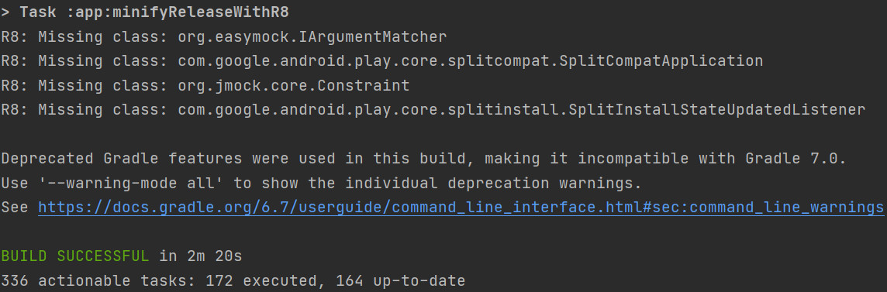

# flutter_bili_talk

A new Flutter project.

## Getting Started

This project is a starting point for a Flutter application.

A few resources to get you started if this is your first Flutter project:

- [Lab: Write your first Flutter app](https://flutter.dev/docs/get-started/codelab)
- [Cookbook: Useful Flutter samples](https://flutter.dev/docs/cookbook)

For help getting started with Flutter, view our
[online documentation](https://flutter.dev/docs), which offers tutorials,
samples, guidance on mobile development, and a full API reference.

1. 接口文档

 * https://api.devio.org/uapi/swagger-ui.html#/ *

2. 错误码

3. flutter状态管理方案：
   

3. 截图

    
    
    
    
    
    
3. 集成测试步骤：
    * .添加测试驱动
       添加测试驱动的目的是为了方便通过flutter drive命令运行集成测试：在项目根目录创建test_driver目录并添加文件 integration_test.dart:
       import 'package:integration_test/integration_test_driver.dart';
       Future<void> main() => integrationDriver();
   
    * .编写测试用例
       在项目根目录创建integration_test目录并添加文件 app_test.dart
   
    * .运行测试用例
       运行集成测试的测试用例可以通过以下命令来完成：
       flutter drive  --driver=test_driver/integration_test.dart --target=integration_test/app_test.dart
       --driver：用于指定测试驱动的路径；
       --target：用于指定测试用例的路径；
    * .查看结果
   

3. flutter性能优化

 * 内存优化 Flutter  Performance
   Flutter性能检测工具Flutter Performance
   在IDE的Flutter plugin中提供了 Flutter Performance 工具，它是一个可用来检测Flutter滑动帧率和内存
   的工具。
   我们可以从IDE的侧边栏中打开这个工具，也可以借助Dart DevTools来查看内存的使用情况：
   此时可以打开一个页面或进行一些操作来观察内存的变化，如果内存突然增大很多就要特别关注是否是
   合理的增加，必要时要排查导致内存增加的原因和考虑对于的优化方案。
   关于如何判断优化后内存有没有变化，可以通过Dart DevTools的Memory选项卡来完成，当你销毁一个
   FlutterEngine后可以通过 GC 按钮来触发一次 sc来查看内存的变化。

 * build()方法优化   执行了耗时的操作,堆砌了庞大的Widget
    * 在build()方法中执行了耗时的操作
      应该尽量避免在build0中执行耗时的操作，这是因为build0方法会频繁的调用，尤其是当父Widget重建的时候；所以，耗时的操作建议挪到initstate()这种不会被频繁调用的方法中；
      另外，我们尽量不要在代码中进行阻塞式操作，可以将文件读取，数据库操作，网络请求这些操作通过Future来转成异步完成；另外对于CPU计算频繁的操作比如：图片压缩等可以使用Isolate来充分利用多核CPU;

    * build()方法中堆砌了庞大的Widget
    如果build中返回的Widget过于庞大会导致三个问题：
        ·代码可读性差：因为Flutter的布局方式的特殊性，画界面我们离不了的需要一个Wdiget嵌套一个Wdiget，但如果Wdiget嵌套太深则会导致代码的可读性变差，也不利于后期的维护和扩展；
        ·复用难：由于所有的代码都在一个build0方法中，会到导致无法将公共的UI代码服用到其它的页面或模块；
        ·影响性能：我们在State上调用setState0时，所有build0中的Widget都将被重建；因此buildO中返回的Widget树越大那么需要重新建的Widget越多，对性能越不利；见下图：

 * 列表方法优化
 * 帧率优化
    一般是列表滑动的流畅度优化，可能是生成列表的方式，比如直接使用了ListView构造方法，这种情况应该使用ListView.build()方法生成列表。
    
    

4. flutter组件化

   组件可以是单独的widget或者单独的包，前提是不依赖外部条件。
   * 根目录下新建文件夹component作为组件根目录
   * 新建flutter new project类型为flutter-package,命名为my_component01
   * 将独立模块的代码放入新组件，在根项目即宿主工程的pubspec.yaml中加入组件的依赖：
   ```
     dependencies:
       flutter:
         sdk: flutter

       # 组件化配置
       my_component01:
         path: ./component/my_component01
   ```
   * 然后即可在宿主中调用组件中的功能

4. 签名打包
 * 配置文件
   * 在android目录下放置签名文件 xxx.jks
   * 在android目录下创建key.properties文件，并编辑：

   ```
    storePassword=11301131
    keyPassword=11301131
    keyAlias=11301131
    storeFile=../xxx.jks
   ```
   * 编辑app目录下的build.gradle：
     首先，在android{...}上面添加：
     ```
       def keystoreProperties = new Properties()
       def keystorePropertiesFile = rootProject.file('key.properties')
       if (keystorePropertiesFile.exists()) {
           keystoreProperties.load(new FileInputStream(keystorePropertiesFile))
       }

     ```
     其次，在android{...}闭包中添加：

     ```
       signingConfigs {
               release {
                   keyAlias keystoreProperties['keyAlias']
                   keyPassword keystoreProperties['keyPassword']
                   storeFile file(keystoreProperties['storeFile'])
                   storePassword keystoreProperties['storePassword']
               }
           }
     ```
     最后，将签名类型默认的debug改为release：

     ```
       buildTypes {
               release {
                   signingConfig signingConfigs.release
               }
           }
     ```

 * 构建release包
    * 构建全部架构的安装包
      cd<flutter应用的android目录>，命令：
      mac:`./gradlew assembleRelease`
      window: `gradlew assembleRelease`
      构建出来的Release包是包含所有ABI架构的。
    * 构建单一架构的安装包
      cd<flutter应用的android目录>
      `flutter build apk --split-per-abi`
      flutter build：命令默认会构建出release包
      --split-per-abi：表示构建单一架构
      

 * 产物：
    